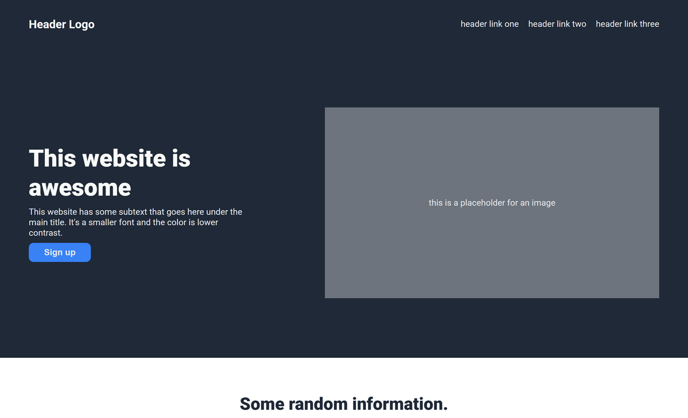

# **Landing Page**



## **Description**

This landing page is a learning project developed as part of the **[Foundations](https://www.theodinproject.com/paths/foundations/courses/foundations)** course by **[The Odin Project](https://www.theodinproject.com/)**.
Its goal is to demonstrate skills in creating responsive and semantically correct web pages using HTML and CSS. 
The project includes typical landing page sections: a hero block, informational cards, a quote, a call-to-action (CTA), and a footer. 
The design follows modern principles, such as a contrasting color scheme, readable typography, and a focus on usability. Landing is implemented using Flexbox for element alignment and responsive structure.

## **Features**

- **Semantic HTML5** with `<header>`, `<section>`, `<footer>`, and `<nav>`.
- **Core Sections**: Header, Hero Block, Info Cards, Quote, CTA Panel, Footer.
- **Flexbox Layout** for responsive content alignment.
- **Color Palette**: Dark blue (`#1F2937`), accent blue (`#3882F6`), light text (`#E5E7EB`).

## **Project Structure**

```sh
├── Main page (index.html)
├── Styles (css/)
└── Assets (assets/)
    └── Images (images/)
```

## **Technologies Used**

- HTML5
- CSS3
- Git and GitHub
- Terminal
- Visual Studio Code

## **Installation & Usage**

1. **Clone repository**

   ```sh
   git clone https://github.com/evgensrc/landing-page.git
   ```

2. **Open in browser**

   ```sh
   cd landing-page
   open index.html
   ```
   Or double-click the file in your file explorer

## **Acknowledgments**

- [The Odin Project](https://www.theodinproject.com/) curriculum team

## **Author**

Evgenii Gavrilko ([evgensrc](https://github.com/evgensrc))

## **Project Links**

**[Live Preview](https://evgensrc.github.io/landing-page/)** and **[Source](https://github.com/evgensrc/landing-page)**.
